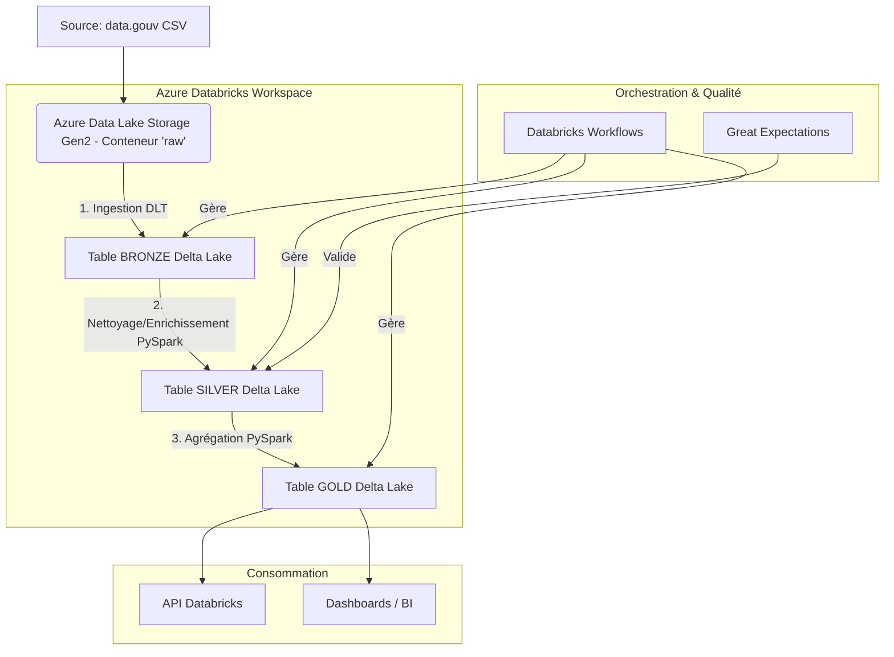

schéma architecture cible pour pipeline de données avec Azure Databricks et Delta Lake

```mermaid
flowchart TD
    A[Source: data.gouv CSV] --> B(Azure Data Lake Storage Gen2 - Conteneur 'raw');
    
    subgraph "Azure Databricks Workspace"
        direction TB
        B -- 1. Ingestion DLT --> C[Table BRONZE Delta Lake];
        C -- 2. Nettoyage/Enrichissement PySpark --> D[Table SILVER Delta Lake];
        D -- 3. Agrégation PySpark --> E[Table GOLD Delta Lake];
    end
    
    subgraph "Orchestration & Qualité"
        F[Databricks Workflows] -- Gère --> C;
        F -- Gère --> D;
        F -- Gère --> E;
        G[Great Expectations] -- Valide --> D;
    end

    subgraph "Consommation"
        E --> H[API Databricks];
        E --> I[Dashboards / BI];
    end
```