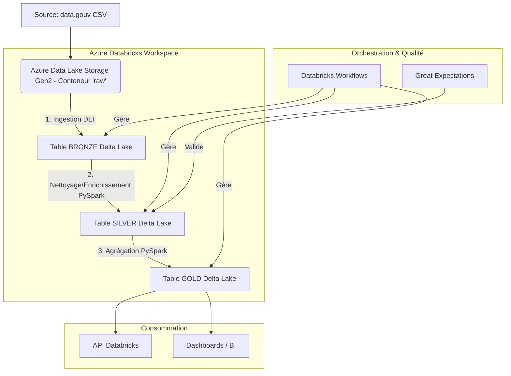

schéma architecture cible pour pipeline de données avec Azure Databricks et Delta Lake


création de l'infrastructure Azure avec Terraform
Pour créer l'infrastructure Azure nécessaire à ce pipeline de données, vous pouvez utiliser Terraform. Voici les étapes à suivre :
> renseigner dans un fichier terraform.tfvars les variables suivantes :
```hcl
location = "northeurope"
project_name = "nom-de-mon-projet" # modifier avec le nom de votre projet
container_name = ["landingzone", "bronze", "silver", "gold"] # liste des conteneurs à créer dans le ADLS Gen2
```
1. Initialiser un projet Terraform
```bash
terraform init
```
2. planifier la création de l'infrastructure
```bash
terraform plan
```
3. Appliquer le plan pour créer l'infrastructure
```bash
terraform apply
```

4. Vérifier la création des ressources dans le portail Azure
> https://portal.azure.com

5. Configurer Azure Databricks pour se connecter à l'Azure Data Lake Storage Gen2
   - Créer un cluster dans Azure Databricks
   - Configurer les accès au ADLS Gen2 via des identités managées ou des clés d'accès
   - Installer les bibliothèques nécessaires (par exemple, Delta Lake, Great Expectations)